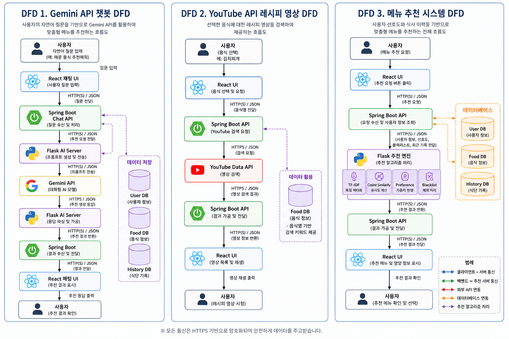
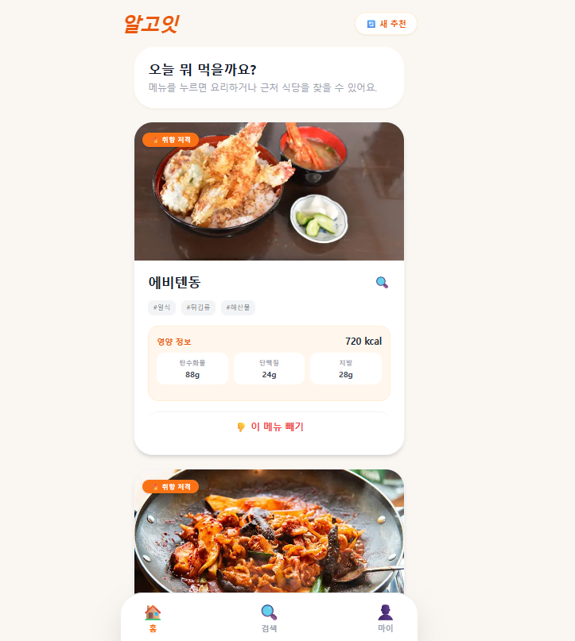
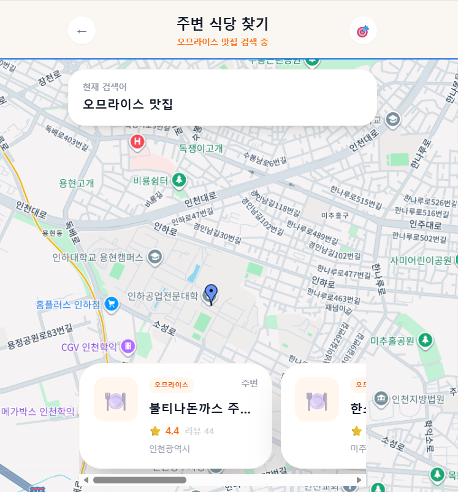

# AlgoEat

AI 기반 개인 맞춤형 메뉴 추천 및 식단 관리 서비스

## Tech Stack

- Frontend : React
- Backend : Spring Boot
- AI Server : Flask
- Database : MySQL
- Cloud : AWS EC2

## 핵심 기능

## Project Structure

## 로그인 화면

## 메인 화면(메뉴 추천 화면)

## 지도 화면

## 챗봇 화면

## 유저 화면

